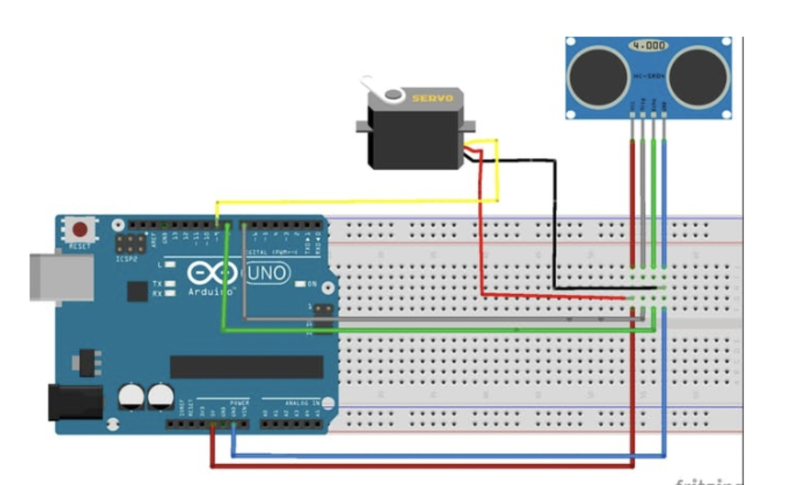

This code is for an Arduino project that uses an ultrasonic sensor to detect the distance of an object and a servo motor to open the lid of a trash can when an object is detected within a certain range.

### Hardware Requirements:

- Arduino Board
- Ultrasonic Sensor
- Servo Motor

### Installation and Usage
- Connect the ultrasonic sensor's trig pin to pin 9 of the Arduino, echo pin to pin 10, and the servo motor's signal pin to pin 11.
- Upload the code to the Arduino board.
- Open the Serial Monitor on the Arduino IDE to see the distance measured by the ultrasonic sensor.
- When an object is detected within 20 cm of the sensor, the servo motor will open the lid of the trash can for 1 second.

### Code Explanation
The code starts by defining the pins for the ultrasonic sensor and servo motor. The ultrasonic sensor's duration and distance variables are also declared.

In the setup() function, the pins for the ultrasonic sensor and servo motor are initialized as inputs and outputs, respectively. The serial communication is also initialized for debugging purposes.

The loop() function sends a pulse to the ultrasonic sensor, measures the duration of the pulse, and calculates the distance based on the duration. The distance is printed to the serial monitor for debugging purposes.

If an object is detected within 20 cm, the servo motor is activated to open the lid of the trash can for 1 second. The program then waits for 500 ms before taking another measurement.

